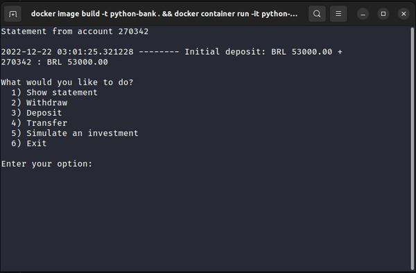

<h1 align="center"> Python Bank ATM </h1>
<!--  -->
<p align="center">
  
  
</p>

### Tópicos 

:small_blue_diamond: [Descrição do projeto](#descrição-do-projeto)

:small_blue_diamond: [Pré-requisitos](#pré-requisitos)

:small_blue_diamond: [Como rodar a aplicação](#como-rodar-a-aplicação-arrow_forward)


## Descrição do projeto 

<p align="justify">
  Esse projeto é resultado dos cursos sobre POO e coleções em Python na <a href="https://www.alura.com.br">Alura</a>. Trata-se de um sistema simples de um caixa eletrônico.
</p>

## Pré-requisitos

:warning: [Docker](https://www.docker.com/get-started/)


## Como rodar a aplicação :arrow_forward:

No terminal, clone o projeto: 

```
git clone https://github.com/alvesgf16/python-bank.git
```

Entre no diretório do repositório que você acabou de clonar:

```
cd python-bank
```

Para subir e executar um container da aplicação:
```
  docker image build -t python-games . && docker run -it python-games
```

## Vídeos da aplicação em uso

- Interface inicial


- Operações




## Linguagens utilizadas

- [Python](https://www.python.org/)


## Tarefas em aberto

:memo: Adicionar docstrings

:memo: Desenvolver testes

:memo: Melhorar a UI

:memo: Traduzir README para o inglês

:memo: Desenvolver interface de aplicativo 
